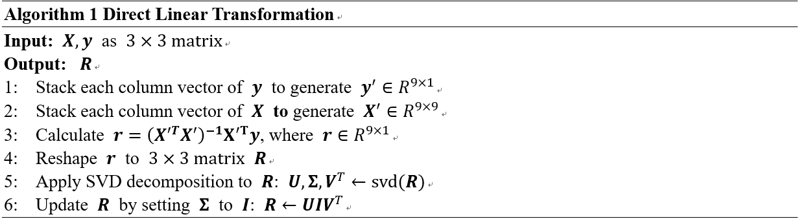
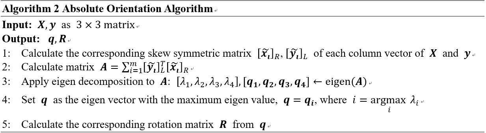

# Close Form Approach
 
 This is the fourth assignment of the lesson and it requires us to write a small program to solve a rotation matrix with close form approach such as Direct Linear Transformation method (DLT) and Absolute Orientation algorithm. We also compare them with Gauss-Newton Algorithm implemented in Assignment 2 by adding Gauss noise to the input vectors.

## 1. Requirements
#### General
- Python (verified on 3.6.3)

#### Python Packages
- numpy (verified on 1.14.3)
- matplotlib (verified on 2.2.2)
- argparse (standard library, verified on 1.1)
- scipy (verified on 0.19.1)

## 2. Algorithm




## 4. Run the scripts

### Install the requirements

```
pip install -r requirements.txt
```

### Introduction of scripts

- __./methods/*.py__

In addition to `__init__.py`, there are three scripts in ./methods/ directory. They implement the above algorithm. In each script there is also a `main`function so you can simply run the script to test the corresponding algorithm.

- __main.py__

This script compares the performance of three algorithms on the same input vectors without additive noise

The script use `argparse` module to make it easy to write user-friendly command-line interfaces. You can use option `-h` or `--help` to get a useful usage message.

```
usage: main.py [-h] [--maxits [MAXITS]] [--seed [RANDOM_SEED]] [--var [VAR]]
               [--add_noise] [--save]

optional arguments:
  -h, --help            show this help message and exit
  --maxits [MAXITS]     Maximum number of iterations of the algorithm to
                        perform. Default 256.
  --seed [RANDOM_SEED]  Random seed. Default 0
  --var [VAR]           The variance of the additive Gauss noise. Default 1.0
  --add_noise           Whether to add Gauss noise to the input vectors.
  --save                Whether to save the results.

```

Note: You can get solution.mat file in `./result/` if you specify `--save` option. 

For example:

```
python -m main.py --seed 20 --save
```

- __noise.py__

This script implements the noise experiment. It does not use `argparse` module. You can just run it without any extra setting. If you want to modify the codes, you can:

+ Go to line 17 to change the random seed so as to change the initial estimate of the solution for Gauss-Newton Algorithm.

```
17      np.random.seed(20)
```

+ Go to line 36 to change the range of variance so as to change the power of the Gauss noise.

```
36      vars = np.linspace(0,100,100)
```
