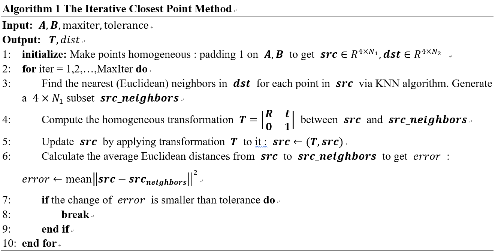

# Iterative Closest Point

 This is the fifth assignment of the lesson and it requires us to write a small program to implement the Iterative Closest Point method (ICP) which finds a best fit rigid transformation between two point clouds. 

## 1. Requirements
### 1.1 General
- Python (verified on 3.6.3)

### 1.2 Python Packages
- numpy (verified on 1.14.3)
- matplotlib (verified on 2.2.2)
- argparse (standard library, verified on 1.1)
- scipy (verified on 0.19.1)

## 2. Algorithm



## 4. Run the scripts

### 4.1 Install the requirements

```
pip install -r requirements.txt
```

### 4.2 Introduction of scripts

#### i. __./methods/*.py__

In addition to `__init__.py`, there are two scripts in ./methods/ directory. They implement ICP Algorithm and Absolute Orientation Algorithm.

#### ii. __main.py__

This script use the ICP algorithm we implement to solve the transformation between two groups of point clouds both given and generated (seen as the following graph). There are two important functions, that is `solve()` and `validate()`, in the script. The `solve()` function solves the homogeneous transformation between the given point clouds and the `validate()` function validates the ICP algorithm on other two point clouds we randomly generate.


The script does not use `argparse` module. You can just run it without any extra setting. If you want to modify the codes, you can:

- Modify the codes from line 70 to line 74 to change the input point clouds.

```
70      np.random.seed(0)
71      x = np.random.uniform(0,10,(3,1000))
72      src = np.ones((4, 1000))
73      src[:3,:] = np.copy(x)
74      y = np.dot(T, src)[:3,]
```

Note: You can get solution.mat file in `./result/`. 