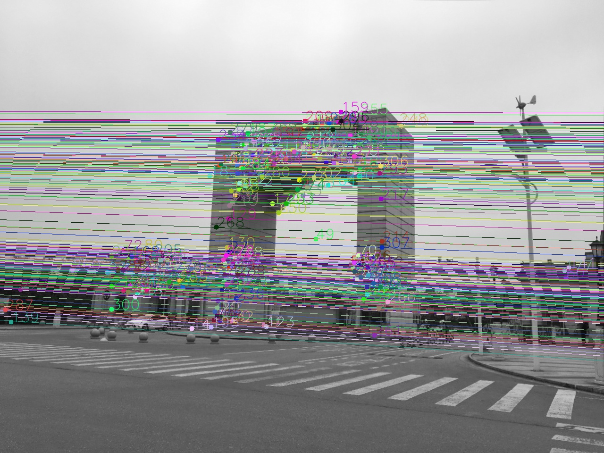
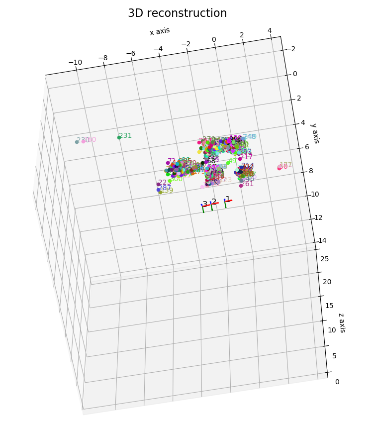

# Final Term Project

 This is the final term project of the lesson. It requires us to write a program to implement the __Structure from motion__ (Sfm) method. Sfm is a photogrammetric range imaging technique for estimating three-dimensional structures from two-dimensional image sequences that may be coupled with local motion signals. 

 In this project, we implement several procedures such as __camera calibration__, __photo undistortion__, __feature matching__, __pose estimation__, __triangulation__ and __bundle adjustment__. Our code is based on [OpenCV Document](https://docs.opencv.org/3.1.0/d9/db7/tutorial_py_table_of_contents_calib3d.html) and also references to [Scipy's cookbook](https://scipy-cookbook.readthedocs.io/items/bundle_adjustment.html).

## 1. Environment

### Requirements

#### General
- python (verified on 3.6.7)

#### Python Packages
- numpy (verified on 1.12.1)
- matplotlib (verified on 2.2.2)
- scipy (verified on 0.19.1)
- __opencv (verified on 3.4.2 (anaconda's version) and 3.2.0.7 (pip's version))__

### Issue of OpenCV

I recomment you simply setup the required environment using anaconda or pip by following the instruction in next section [Setup with anaconda or pip](#Setup-with-anaconda-or-pip). If everything works well, you will get there and can ignore this section. But if you find that SIFT cannot be used in opencv, please check the following instruction.

When using opencv, you may encouter the following issue.

```
Traceback (most recent call last):
  File "\<stdin\>", line 1, in \<module\>
cv2.error: OpenCV(3.4.5) C:\projects\opencv-python\opencv_contrib\modules\xfeatures2d\src\sift.cpp:1207: error: (-213:The function/feature is not implemented) This algorithm is patented and is excluded in this configuration; Set OPENCV_ENABLE_NONFREE CMake option and rebuild the library in function 'cv::xfeatures2d::SIFT::create'
```

SIFT and SURF are examples of algorithms that OpenCV calls "non-free" modules. These algorithms are patented by their respective creators, and while they are free to use in academic and research settings, you should technically be obtaining a license/permission from the creators if you are using them in a commercial (i.e. for-profit) application.

With OpenCV 3 came a big push to move many of these "non-free" modules out of the default OpenCV install and into the "opencv_contrib" package. The "opencv_contrib" packages contains implementations of algorithms that are either patented or in experimental development.

The algorithms and associated implementations in "opencv_contrib" are not installed by default and you need to explicitly enable them when compiling and installing OpenCV to obtain access to them.

For more information, check [this page](https://www.pyimagesearch.com/2015/07/16/where-did-sift-and-surf-go-in-opencv-3/).

### Setup with anaconda or pip

Setup a Python virtual environment (optional):

```
conda create -n m_env python=3.6.7
source activate m_env
```

Install the requirements:

``` 
conda install --file requirements.txt
conda install opencv
```

or

``` 
pip install -r requirements.txt
pip install opencv-contrib-python==3.2.0.7
```

If everything works well, you can run `python -m main.py -h` to display some help message. If you put some chessboard photos in `./chessboard_pattern` directory, then you can run `python -m main.py` without any other arguments for default to perform SFM on three photos with basename `gate` that I have put in `./raw_images` directory. 

## 2. Detailed Documentation

Detailed documentation and examples of how to use the scripts are given below.

|  Directory or file name  |               description                   |
| ------------------------ |:-------------------------------------------:|
| ./chessboard_pattern/    | directory to put chessboard patterns        |
| ./raw_images/            | directory to put input photos               | 
| ./utils/                 | contains all functional scripts             |
| ./.tmp/                  | contains caches during the procedure and the results |

The `main.py` script in root directory is the top script. You can run it with some command-line arguments to perform an Sfm procedure. Please use option `-h` or `--help` to get a useful usage message.

### main.py

```
usage: main.py [-h] [--all] [--calibration] [--undistortion] [--custom]
               [--image-base IMAGE_BASE]
               [--resolution [RESOLUTION [RESOLUTION ...]]]

optional arguments:
  -h, --help            show this help message and exit
  --all                 Specify to run all procedures.
  --calibration         Whether to calibrate camera. Your chessboard patterns
                        should be stored in ./chessboard_pattern directory.
  --undistortion        Whether to undistort raw images. Your raw images data
                        should be stored in ./raw_images.
  --custom              Whether to use custom methods.
  --image-base IMAGE_BASE
                        The basename of image files. Default 'gate'
  --resolution [RESOLUTION [RESOLUTION ...]]
                        Image Resolution. The program will resize all images
                        to this specification. Default [1280,960]
```

## 3. Tutorial

### 3.1 Preparation for camera calibration

- __Generate the calibration pattern__: 

    Generate and print a checkboard pattern. Then paste it on a flat panel. You may want to make the pattern yourself or download the pattern file in [pdf](http://www.vision.caltech.edu/bouguetj/calib_doc/htmls/pattern.pdf) format. In this pattern, each square is 30mm x 30mm. 

- __Take several photos in different views__:
    
    Acquire any number of images (no maximum number, but more than 10 recommended), and save them in `./chessboard_pattern/` directory in either format: jpg, png, tif or bmp. There are no special requirements for the naming of image files.

### 3.2 Prepare input photos

- __Select a suitable scene and take three photos__
    
    - The selected scene should be rich in texture and its three-dimensional structure should be prominent (do not choose a purely flat scene).
    - There must be enough baseline between the three shooting angles, and the angle between the three angles should be controlled to be no more than 30 degrees. Otherwise it will be difficult to match feature points.

- __Naming rule__

    - The image file names must start with a common basename, followed by a underline and a number (__two fixed slots__, and all numbers must be in sequence with step one), and the file extension (jpg, png, tif or bmp). Example: `gate_01.jpg`, `gate_02.jpg`, `gate_03.jpg`. 

### 3.3 First run

All the procedures of Sfm are implemented in `main.py`, including camera calibration, photo undistortion, feature matching, pose estimation, triangulation and bundle adjustment.

When you run the script for the first time, you should calibrate the camera and also undistort your input photos. So you should specify `--calibration` and `--undistortion` options or just `--all` option in simple.

```
python -m main.py --image-base gate --all
```

Remember that you should specify the basename of you input image files with `--image-base`.

After the above operation, you can check the results in `./tmp/` directory for further usage. If you run the script on an operating system with display, you can see the result directly. 



### 3.4 Further usage

- __Different input photos__

    Assuming that you have finished camera calibration (i.e. the camera parameters including intrinsic matrix and distortion vector should be stored in `./.tmp/calibration_result/camera_parameters.npz` ), you have three new input photos, put them in `./raw_images/` directory and name them as `scene_01.jpg`, `scene_02.jpg`, and `scene_03.jpg`.

    Then you can type the following command line in terminal to reconsturct 3D points cloud and to obtain the poses of camera in three views.

    ```
    python -m main.py --image-base scene --distortion
    ```

    This procedure will skip camera calibration and use the pre-calibrated camera parameters stored in `./.tmp/` directory.

- __Custom implementation of some core algorithms__

    In this project, we use OpenCV package to implement most of the algorithms. However, we also implement some core algorithms (__RANSAC__ and __8-Point Algorithm__) by ourselves.

    You can specify `--custom` option in command line to replace the opencv's methods with these custom methods.

    ```
    python -m main.py --image-base gate --custom
    ```
    
    This procedure will skip camera calibration and undistortion. Remember every time you run the script, you should specify the `--image-base` option as the basename of your own input photo files, or the script will use the default `gate` photos. 

    The implementation of the custom methods can be found in script `utils/m_methods.py`. 


